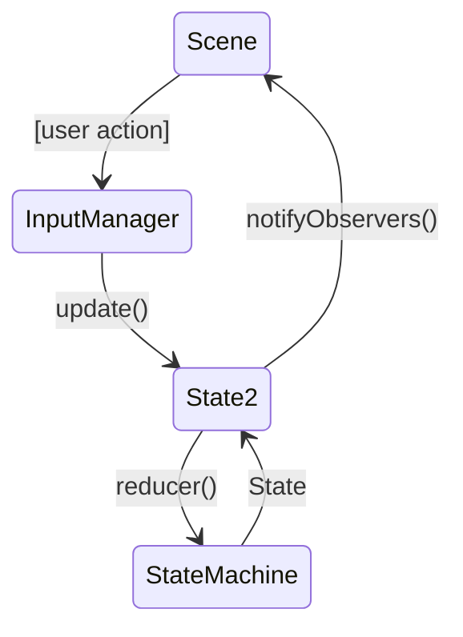
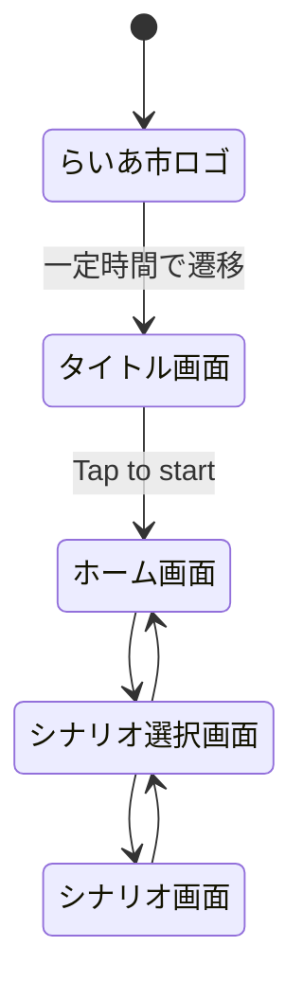

## ライフサイクル

```mermaid
stateDiagram-v2
    Scene --> InputManager: [user action]
    InputManager --> State2: update()

    State2 --> StateMachine: reducer()
    StateMachine --> State2: State

    State2 --> Scene: notifyObservers()
```

## シーン遷移

```mermaid
stateDiagram-v2
    [*] --> らいあ市ロゴ
    らいあ市ロゴ --> タイトル画面: 一定時間で遷移
    タイトル画面 --> ホーム画面: Tap to start
    ホーム画面 --> シナリオ選択画面
    シナリオ選択画面 --> シナリオ画面
    シナリオ画面 --> シナリオ選択画面
    シナリオ選択画面 --> ホーム画面
```
